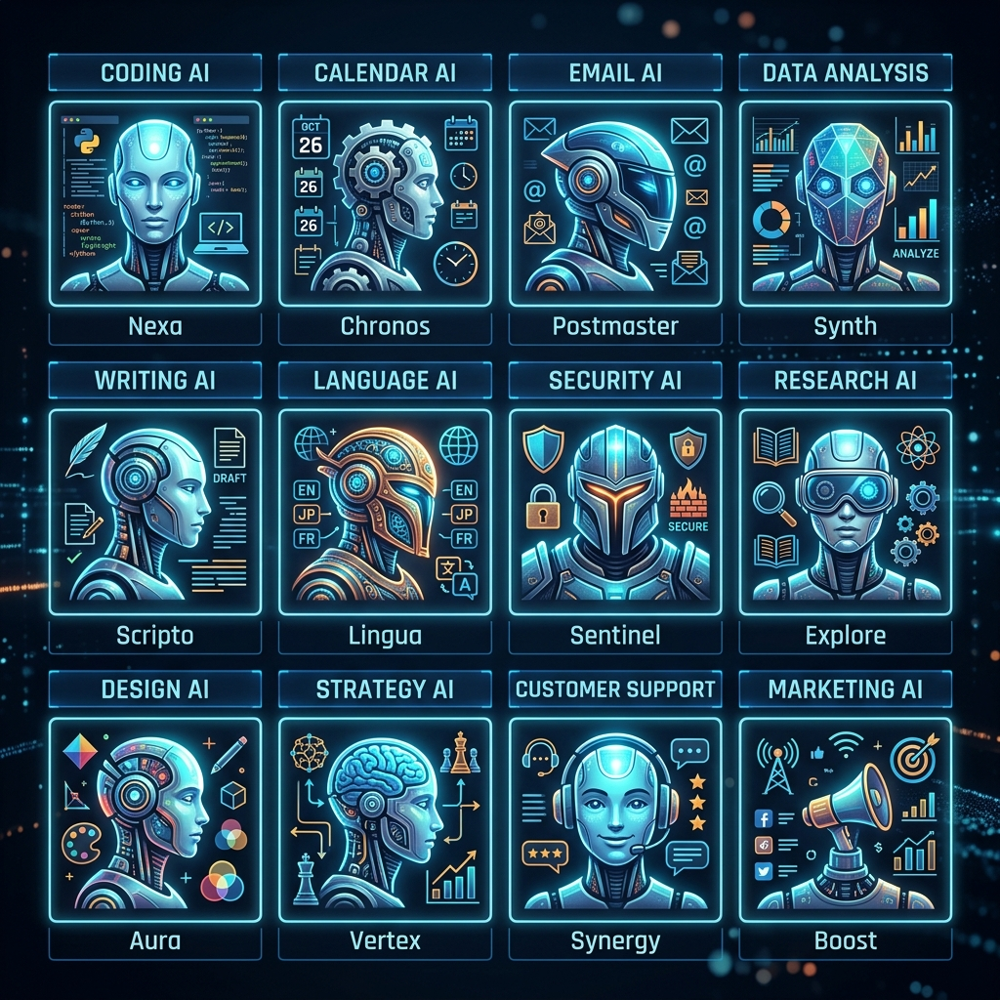

# 12 Master Sub-Agents

SAAP isolates domain logic into 12 distinct actors.

## Purpose of Segmentation
By narrowing the prompt context window for each agent, we reduce LLM hallucination limits drastically. An agent meant to write emails (`Gmail Intelligence`) is completely cut off from the noise of JIRA sprint tracking, ensuring specialized syntax generation.

### The Agent Map
1. **Gmail Intel**: Reads/drafts via Gmail API v1.
2. **Time Intel**: Scans/books via Google Calendar.
3. **Knowledge Store**: Indexes specific directories via Google Drive.
4. **Team Pulse**: Webhooks into Slack for async standups.
5. **Engineering Intel**: Parses PR limits/commits from Github REST.
6. **Data Ops**: Pushes mapped arrays to Google Sheets.
7. **Knowledge Engine**: Writes decisions to Notion.
8. **Market Intel**: Free-form HTTP scraping for news.
9. **Project Tracker**: Board movement parsing via Jira.
10. **Operations DB**: Airtable JSON block matching.
11. **Product Velocity**: GraphQL lookups on Linear.
12. **Revenue Intel**: HubSpot CRM Pipeline mapping.

